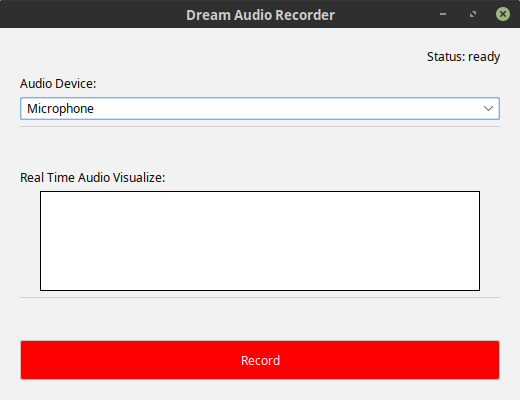

Github CI:

Travis CI:

# Dream Audio Recorder
Record audio on your computer. On default, it listens to your
microphone, but you can freely pick the Audio Device, meaning
that you can also record your system sound (*record system
sound is TODO*).

# 1 Downloads
*TODO: add Downloads*

# 2 Dependencies
* at least Java 8 required
* Java Swing

# 3 Build from source
* install JDK 11
    * make java available from terminal by adding it to Path
        * e.g. `export PATH=/usr/lib/jvm/jdk-11.0.8/bin:$PATH`
        * I added this line to file `.profile` in my home
          directory.
* install maven
* run: `./buildAndRun.sh`

# 4 Run tests
run `./runTests.sh`

This runs audio tests which are excluded in CI.

# 5 Code Coverage report
run `codeCoverageReport.sh`

# 6 Working with IntelliJ GUI Builder
if you continue working on the GUI from IntelliJ, you have to make
sure, that all GUI Builder code is inside your source file. Go to
*File > Settings > Editor > GUI Designer > Generate GUI into: 
Java source code*.

# 7 display all supported audio formats on your system

# 8 License
TODO: check license for mp3 library when implementing it.
