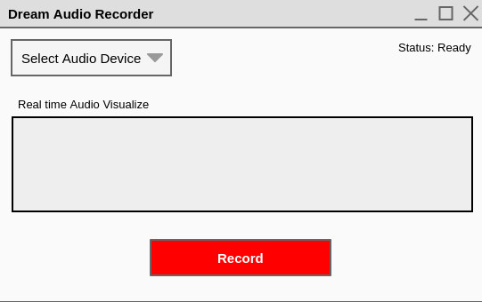

TODO: add badge "Tests passing"

# Dream Audio Recorder
Record audio on your computer. On default, it listens what goes
through your default Audio Output, but you can freely pick
the Audio Device, meaning that you can also record your voice
from a microphone.

# 1 Downloads
TODO: add Downloads

# 2 Dependencies
* Java 11
* Java Swing

# 3 Build from source
* install JDK 11
    * make java available from terminal by adding it to Path
        * e.g. `export PATH=/usr/lib/jvm/jdk-11.0.8/bin:$PATH`
        * I added this line to file `.profile` in my home
          directory.
* install maven
* run: `./buildAndRun.sh`

# 4 Run tests
`./runTests.sh`

# 5 Working with IntelliJ GUI Builder
if you continue working on the GUI from IntelliJ, you have to make
sure, that all GUI Builder code is inside your source file. Go to
*File > Settings > Editor > GUI Designer > Generate GUI into: 
Java source code*.

# 6 License
TODO: check license for mp3 library
